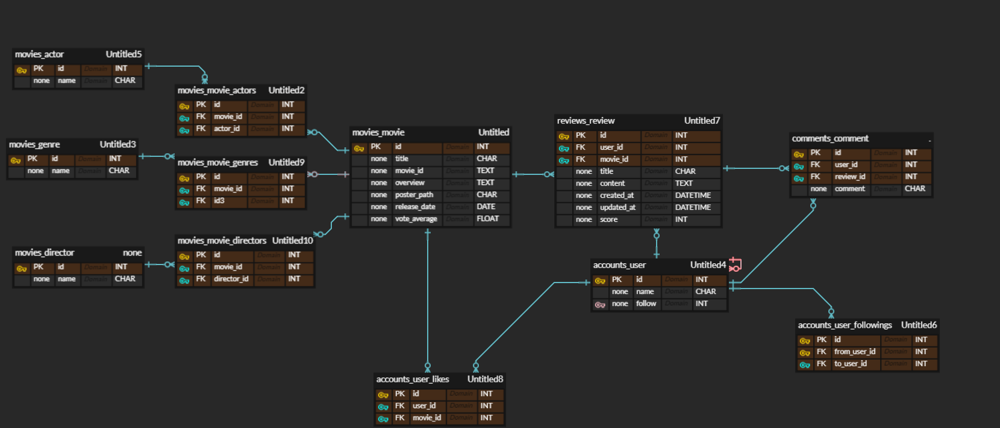

# CINE - 사용자 좋아요 기반 영화 추천 

## 사용 기술 스택

 
 
   
     
 
 
  
      
 
 

## 목표 서비스 구현 및 실제 구현 정도
| 목표 서비스 구현 | 실제 구현 정도|
|-------|-------|
|로그인 로그아웃 | 로그인 로그아웃|
|회원가입 | 회원가입
|영화 전체 목록 조회 | 영화 전체 목록 조회|
|영화 상세 목록 조회 | 영화 상세 목록 조회|
|영화 카테고리별 조회 | 영화 카테고리별 조회|
|영화 리뷰 생성, 삭제 | 영화 리뷰 생성, 삭제
|리뷰 댓글 생성,삭제 | 리뷰 댓글 생성, 삭제
|영화 좋아요 기능 | 영화 좋아요 기능|
|프로필 조회 기능 | 프로필 조회 기능|
|마이페이지  | 마이페이지|
|유저 팔로우 기능 | 유저 팔로우 기능 |
|영화 추천 기능 | 영화 추천 기능|
|영화 별점 구현 | 영화 별점 구현|

## 데이터베이스 모델링(ERD)

## 영화 추천 알고리즘(에 대한 기술적 설명)
> 사용자가 좋아요를 누른 영화를 바탕으로 사용자의 장르별 영화 선호도를 수집   
> 수집한 사용자의 영화 선호도를 바탕으로 사용자 취향 영화 추천

 현재 로그인 중인 사용자가 좋아요를 누른 영화를 모두 가져와 영화를 추천하는 함수에 넘긴다.    
 영화를 추천 하는 함수에서 사용자가 좋아요를 누른 장르별로 1씩 카운트를 올리고, 가장 많이 좋아요가 눌린 상위 3개의 장르를 추출한다.   
 추출된 상위 3개의 장르를 이용해 사용자가 좋아요를 누르지 않은 영화 중 상위 3개 장르가 장르로 존재하는 영화들을 추천 영화 목록으로 넘긴다.

## 핵심 기능

1. 회원가입
- 회원 가입시 이미 있는 사용자 이름이라면 알림창    
- 회원 가입시 비밀번호가 일정 글자 이상 넘어가지 않으면 알림창

2. 로그인/로그아웃
- 로그인 시 데이터베이스에 있는 사용자 이름이 아니라면 회원가입 알람창
       

 
3. 영화 전체 목록 조회
- 메인페이지에서 영화 포스터와 제목, 별점을 함께 띄우고, 포스터를 클릭하면 상세 페이지로 이동    
- 최상단에 케로셀을 통해 영화 포스터, 제목, 상세페이지를 띄우고 자동으로 넘어가도록 구현    
- 케로셀에 띄우는 영화는 랜덤으로 구현

4. 영화 상세 페이지
- 영화 포스터, 제목, 감독, 배우, 장르, 상세소개 조회 가능    
- 로그인한 사용자라면 영화 상세페이지에서 리뷰 생성 가능    
- 해당 영화에 쓰인 리뷰 목록을 하단에 띄워 한번에 조회 가능

5. 리뷰 생성/ 삭제
- 로그인한 유저라면 영화 상세 페이지에서 모달을 통해 리뷰 생성 가능         
- 현재 로그인 중인 유저와 해당 리뷰를 쓴 유저가 같다면 리뷰 삭제 가능      
- 로그인 하지 않은 유저라면 영화 상세 페이지 조회만 가능

6. 댓글 생성/ 삭제
- 현재 로그인 중인 유저라면 리뷰에 댓글 생성 가능         
- 로그인 하지 않았다면 리뷰 조회만 가능      
- 현재 로그인 중인 유저와 댓글을 작성한 유저가 같다면 댓글 삭제 가능

7. 카테고리별 영화 조회
- 상단 바에서 특정 영화 장르를 클릭하면 해당 장르의 영화 목록 조회 가능         
- 포스터 클릭시 상세페이지로 이동 가능
           
   

8. 프로필 페이지
- 현재 유저가 로그인 중이라면 마이페이지 이동, 다른 유저의 페이지 확인 가능          
- 현재 유저가 로그인 중이 아니라면 다른 유저의 페이지 조회만 가능        
- 다른 유저의 프로필 페이지를 통해 유저간 팔로우 가능      
- 현재 프로필 페이지 유저의 팔로우/팔로잉 수 조회 가능       
- 현재 프로필 페이지 유저가 몇개의 리뷰를 생성했는지, 좋아요를 누른 영화가 몇개인지 조회 가능      
- 현재 프로필 페이지유저가 좋아요를 누른 영화 포스터 출력

9. 영화 추천 기능        
- 현재 사용자가 로그인 중이라면 마이페이지, 상단 바에서 영화 추천 기능 접속 가능          
- 만일 현재 좋아요를 누른 영화가 없다면 추천페이지에서 영화 목록을 띄우고 좋아요를 누르도록 화면 설정
  

     
- 해당 화면에서 좋아요를 누르고 영화 추천받기 버튼을 누르면 페이지가 새로고침되면서 추천 영화 목록들의 포스터를 띄우도록 설정    

## Team Informations
- 최다희
> 화면 프레임 설계   
> Back(DRF)   
 &ensp;&ensp;   리뷰 작성, 댓글 작성 기능 구현   
 &ensp;&ensp;   유저간 팔로우 기능 구현   
 &ensp;&ensp;   좋아요 기능 구현   
 &ensp;&ensp;   사용자 프로필 페이지 구현   
 &ensp;&ensp;   영화 데이터 로드(JSON)   
 &ensp;&ensp;   리뷰 작성, 댓글 작성 기능 구현   
 &ensp;&ensp;   유저간 팔로우 기능 구현   
 &ensp;&ensp;   좋아요 기능 구현   
 
> Front(Vue.js Script)   
 &ensp;&ensp;    영화 카테고리 페이지 구현(장르별 필터 + css)   
 &ensp;&ensp;    Django와 기능 연결   

> Front(vue.js template)    
 &ensp;&ensp;    프로필 페이지   
 &ensp;&ensp;    전체 화면, 카테고리 화면    

-윤하현
>ERD 설계 및 구현   
>Back(DRF)   
&ensp;&ensp;    회원가입 기능   
&ensp;&ensp;   사용자 식별하여, 중복된 아이디 or 비밀번호가 일치하지 않을 경우 회원가입 불가   
&ensp;&ensp;  로그인, 로그아웃 기능   
&ensp;&ensp;    사용자 식별하여, 로그인/비로그인 사용자에 따라 사이트 접근성 다르게 부여   

>Front(Vue.js template)    
&ensp;&ensp;   영화 상세페이지 및 리뷰 상세페이지에 게시글 생성시 모달 기능 구현   
&ensp;&ensp;   메인페이지 캐로셀 기능 구현   
&ensp;&ensp;   영화 상세 페이지, 리뷰 페이지 css   

## 후기
-최다희   
: 처음으로 django와 vue를 사용해 하나의 프로젝트를 완성해 보았습니다. 프로젝트를 시작할때만 해도 django와 vue에서 어떻게 서로 데이터를 주고 받아야 할지 막막했지만 한 학기동안 배운 것들을 활용해 해나갈 수 있었다고 생각합니다.    프로젝트를 진행하며 네트워크 오류와 모델 설정이 잘못된 오류 등 다양한 오류와 마주했습니다. 이런 오류들을 통해 django와 vue를 연결핼때 주의해야 할점이 무엇인지 학습할 수 있었고, 초기 모델 설정을 꼼꼼히 할 필요성을 느꼈습니다.
vue에서는 화면에 원하는 대로 요소들을 배치하는데 어려움을 겪었습니다. 다음 프로젝트에서는 css지식을 보완해 더 완성도 높은 화면을 사용자에게 제공하고 싶습니다.

-윤하현   
:비동기적으로 페이지를 구성하기 위해서 django+vue.js를 같이 사용하여
처음으로 프론트엔드와 백엔드의 협업으로 웹페이지를 구성해보았다.
생각보다 복잡하고, 웹페이지를 구성하는 과정에서 수번의 오류를 거쳐 여러번의 수정이 필요했다.
이 과정에서 프론트엔트와 백엔드의 작업이 다른 만큼 두 파트 간의 소통과 협업이 중요하다고 느꼈다.
또 css를 더 역동적으로 만들기 위해서 추가적인 학습이 필요하다고 느꼈다.
